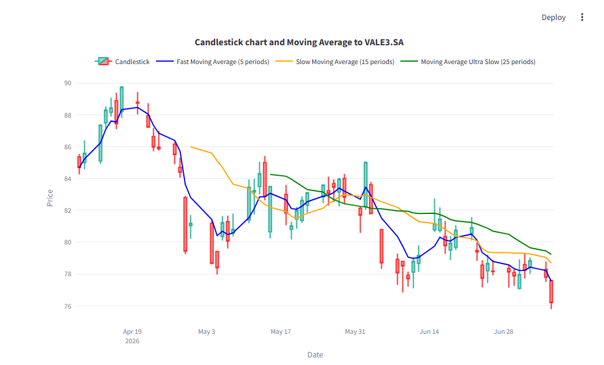

# Finance-project-2

Following my personal series on finance in Python, we have the second finance project. 
In this project, the main goal is technical analysis. So, in this project, I calculated the moving average (MA), which is very useful 
to find the right moments to buy and sell the tickers. Here, I have two types of MA: fast and slow. The fast MA tracks the ticker's price closely, while the slow MA has some lag. Normally, the cross between the fast and slow MAs determines the moment to buy or sell the ticker.

